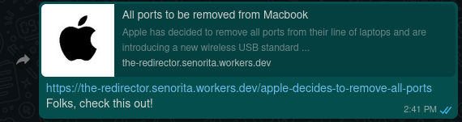
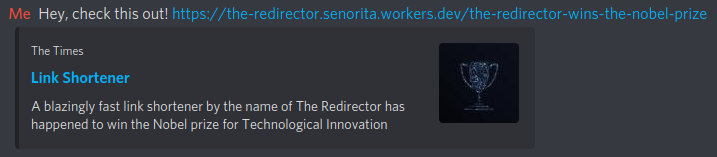

# The Redirector

> A blazingly fast link shortener built on CloudFlare Workers KV that also allows you to set custom metadata to the redirected link.

### Custom metadata? What do you mean?

When it comes to messaging apps like Discord, WhatsApp or Slack, you're probably familiar with the fact that when you send a link in chat, a link preview is generated. But what if I told you—_the link preview is a lie!_ Generated link previews actually depend on something called Open Graph meta tags, which this link shortner allows you to conveniently set 😎

Here's a few of examples of how you can set the link previews to anything you'd like it to be.



## Installation

1.  [Install Wrangler](https://developers.cloudflare.com/workers/cli-wrangler/install-update)

```zsh
cargo install wrangler
```

2. Clone this repository locally

```zsh
git clone https://github.com/radiantly/the-redirector
cd the-redirector

# Copy the sample config file
cp wrangler.example.toml wrangler.toml
```

3. Add your config to `wrangler.toml` (your account ID, KV namespace, etc)
4. Build and publish

```
npm install
npm run build
wrangler publish
```

## Contributing

Before contributing patches, you may need a CloudFlare Workers account to test changes locally. The key files used in the project are:

- `worker.js` - This is the code that runs in the backend
- `public/` - These files are served on the frontend
- `staticpack.js` - This is a script that bundles the files in public and worker.js to a single `index.js` which is the final file that is served.

To test your changes,

```zsh
npm run build
wrangler run dev
# or
wrangler preview
```

Furthermore, if you use linux, you can use `npm run dev` or `npm run preview` to automatically build and run every time you save a file.

<details>
<summary><strong>History</strong></summary>

This project first started out as a repo for a list of internet pranks, aptly named `box-of-tricks`, and was built as a project for the MLH Hack-or-treat hackathon by Team Cheesy (comprising of my friend [Jason](https://github.com/Jason13201) and [I](https://github.com/radiantly)). We came up with 3 pranks, a fake mouse, an infinite app opener vb script, and the redirect prank (inspired from [jere-mie/routing-prank](https://github.com/jere-mie/routing-prank)). For the redirect prank, we used CockroachDB (one of the sponsor technologies) but never got it completely working.

I dearly wanted to get the redirect prank working, so I rewrote the logic with Next.js and Airtable. This just so happened to be the wrong tool for the job with multiple caveats. There were issues generating the redirect page, and it frankly wasn't fast enough.

The project was then moved to CloudFlare workers.

</details>

## License

MIT License.
